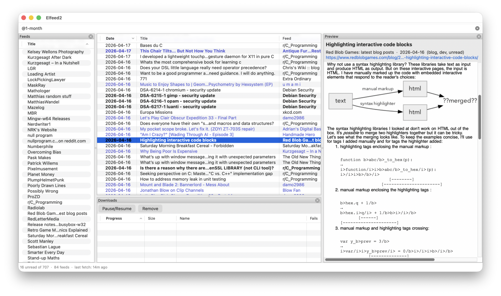

# Elfeed2 : the Elfeed feed reader experience without Emacs

Standalone feed reader, successor to [Elfeed][elfeed]. The goal: replicate
the Elfeed experience without Emacs. Built with C++20, wxWidgets, SQLite3,
pugixml, cpp-httplib, and mbedTLS.

The import feature (File menu) loads your classic Elfeed database into the
Elfeed2 database so you can continue seamlessly. Like the original Elfeed,
the set of feeds to fetch is not stored in the database but sourced from a
hand-written configuration file. On the first run without a configuration,
Elfeed2 installs a sample configuration to get you started. Update it with
your favorite text editor.

[Input and ideas are welcome][discussion] as the UI takes shape.

## Build

Requires CMake 3.25+ and a C++20 compiler. By default all dependencies
are fetched automatically (pinned versions, hermetic build):

    $ cmake -B build
    $ cmake --build build

Distribution packagers use system-installed dependencies (wxWidgets 3.2,
SQLite3, pugixml, OpenSSL, cpp-httplib) with `-DDEPS=LOCAL`:

    $ cmake -B build -DDEPS=LOCAL
    $ cmake --build build

`DEPS=LOCAL` builds use OpenSSL for TLS (universally available wherever
cpp-httplib is packaged); the bundled `DEPS=FETCH` build uses a pinned
mbedTLS to keep the self-contained binary smaller and avoid an OpenSSL
runtime dependency. On Debian or Ubuntu install these dependencies:

    $ apt install libcpp-httplib-dev libpugixml-dev libsqlite3-dev libwxgtk3.2-dev

To cross-compile a self-contained Windows binary on Linux or macOS using
Mingw-w64:

    $ cmake -B build -DCMAKE_TOOLCHAIN_FILE=cmake/Toolchain-Mingw64.cmake
    $ cmake --build build

The Windows build uses WinHTTP + Schannel by default, which is the right
call for Windows 7 and newer. For Windows XP, whose Schannel can't
negotiate modern TLS cipher suites, switch the HTTP backend to
cpp-httplib + mbedTLS; Elfeed2 embeds Mozilla's CA bundle and writes it
to the user data dir at launch so there's no dependency on a system trust
store:

    $ cmake -B build -DCMAKE_TOOLCHAIN_FILE=cmake/Toolchain-Mingw64.cmake \
        -DELFEED2_HTTP_BACKEND=cpp-httplib

## Configuration and command line

    $ elfeed2 [-h] [-d|--db PATH] [-c|--config PATH]

By default, the database lives at the platform's user data directory:

* macOS: `~/Library/Application Support/elfeed2/elfeed.db`
* Windows: `%APPDATA%\elfeed2\elfeed.db`
* Linux: `$XDG_DATA_HOME/elfeed2/elfeed.db`

On all systems, configuration is at:

    $XDG_CONFIG_HOME/elfeed2/config
    ~/.config/elfeed2/config

Override either with `--db` and `--config`. Useful for running a test or
scratch instance alongside your real one — the single-instance guard is
per-DB, so multiple instances against different databases don't conflict.

The configuration is a line-oriented format similar to `ssh_config`.
Directives are `keyword value`, blank lines are cosmetic, and comments
start with `#` at the start of a line or preceded by whitespace and
followed by whitespace (so `#`-prefixed values like `#f9f` aren't mistaken
for comments).

**Nothing in the configuration is entered into the database.** The
database only contains run-time data, such as fetched feed data and UI
state.

### Global settings

    download-dir          ~/Downloads      # ~ expands to your home
    yt-dlp-program        yt-dlp
    yt-dlp-arg            --no-warnings    # repeatable
    yt-dlp-arg            --embed-metadata
    default-filter        @6-months-ago +unread
    max-connections       16
    fetch-timeout         30               # per-feed, seconds
    max-download-failures 5                # then mark "failed" until Retry
    log-retention-days    90               # DB log history kept across runs

### Feeds

A line whose first token contains `://` opens a new feed stanza. Lines
after it apply to that stanza until the next URL line. `title` overrides
the feed's self-declared title; `tag` adds autotags (one or more per line,
repeatable).

    https://nullprogram.com/feed/
      title null program
      tag   blog programming

    https://example.com/comic/feed/
      tag comic webcomic

Indentation is cosmetic, and the parser doesn't require it.

### Aliases (macros)

An `alias NAME TEMPLATE` directive defines a shortcut. Using the alias
name in place of a URL expands `{}` in the template with the rest of the
line:

    alias youtube https://www.youtube.com/feeds/videos.xml?channel_id={}
    alias reddit  https://old.reddit.com/r/{}/.rss

    youtube UCq8ZAAsI89IoJ-fn1gYpO3g
      title            Kurzgesagt After Dark
      tag              youtube history

    reddit C_Programming
      tag programming

### Per-tag colors

A `color TAG #RRGGBB` (or `#RGB` shorthand) directive tints entries in the
listing whose tag list includes `TAG`. The first directive matching an
entry wins, so order them by priority.

    color youtube #ff99ff
    color news    #88c0d0
    color hn      #d08770

Foreground only (not background), applied on top of the default styling
including bold for unread entries.

### Filter presets

A `preset KEY FILTER` directive binds a single key to a filter string.
While the entry list has focus, pressing that key jumps the filter bar
(and the listing) to that filter. Built-in keys take precedence.

    preset h @1-month +unread
    preset t @1-month +youtube
    preset T @1-month -youtube

## Usage

### Filter syntax

The filter bar controls which entries are displayed. Press **s** or
**/** to edit the filter, **Enter** to submit, **Escape** to cancel.
Tokens are space-separated:

| Prefix | Meaning                       | Example               |
|--------|-------------------------------|-----------------------|
| `+`    | Must have tag                 | `+unread`             |
| `-`    | Must not have tag             | `-junk`               |
| `@`    | Age limit                     | `@6-months-ago`       |
| `@`    | Age range                     | `@1-year-ago--1-week` |
| `#`    | Limit result count            | `#50`                 |
| `=`    | Feed URL must contain         | `=example.com`        |
| `~`    | Feed URL must not contain     | `~spam.example`       |
| `!`    | Title must not match          | `!sponsor`            |
| (bare) | Title must match              | `linux`               |

Age units: `year`/`y`, `month`/`M`, `week`/`w`, `day`/`d`, `hour`/`h`,
`min`, `sec`/`s`. Suffixes like `-ago` and `-old` are ignored.

### Listing keys

| Key         | Action                                   |
|-------------|------------------------------------------|
| `j` / `k`   | Move cursor down / up                   |
| `g` / `G`   | Jump to first / last entry               |
| `Enter`     | Focus the preview pane (reader mode)     |
| `b`         | Open entry link in browser               |
| `y`         | Copy entry link to clipboard             |
| `u`         | Mark unread (advances cursor)            |
| `r`         | Mark read (advances cursor)              |
| `Ctrl+L`    | Re-apply filter (re-query)               |
| `v`         | Toggle visual selection                  |
| `Ctrl+A`    | Select all entries                       |
| `s` / `/`   | Edit filter                              |
| `f`         | Fetch all feeds                          |
| `d`         | Download enclosure                       |
| `D`         | Toggle Downloads panel                   |
| `l`         | Toggle Log panel                         |
| `Escape`    | Clear selection                          |

Visual selection (`v`) anchors at the focused row; subsequent `j`, `k`,
`g`, `G` extend the selection from the anchor to the new cursor. Any
row-acting key (`u`, `r`, `b`, `y`, `d`) runs against the whole range and
then exits visual mode; `Escape` or `v` again also exits.

### Filter editing keys

| Key         | Action                                   |
|-------------|------------------------------------------|
| `Enter`     | Submit filter                            |
| `Escape`    | Cancel and restore previous filter       |
| `Backspace` | Delete character                         |
| `Ctrl+W`    | Delete word                              |

### Entry detail keys

| Key            | Action                        |
|----------------|-------------------------------|
| `q` / `Escape` | Return to listing             |
| `j` / `k`      | Scroll body down / up         |
| `n` / `p`      | Next / previous entry         |
| `b`            | Open link in browser          |
| `y`            | Copy link to clipboard        |
| `d`            | Download enclosure            |
| `r` / `u`      | Mark read / unread (advances) |

### Download manager

Elfeed2 can download enclosures (e.g. podcasts) using its built-in HTTP
client. Titles are automatically generated from the entry date and title.
Media entries (e.g. YouTube feed items) download with [yt-dlp][]. All are
managed in a common download manager. Pressing `d` on an entry takes the
appropriate download action and registers it in the download manager.

[discussion]: https://github.com/skeeto/elfeed2/discussions
[elfeed]: https://github.com/skeeto/elfeed
[yt-dlp]: https://github.com/yt-dlp/yt-dlp
